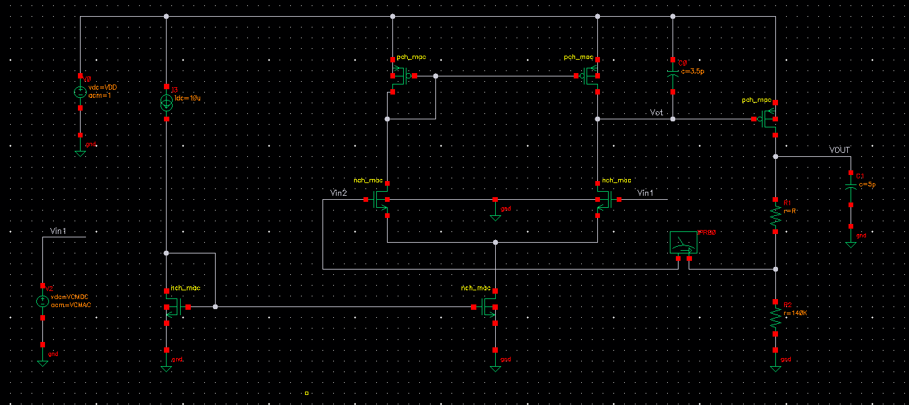

# Programmable LDO & OTA Design (65nm CMOS)

**Course:** EECG221 - Basic Electronic Circuits (Cairo University, Fall 2025)
**Technology:** 65nm CMOS
**Tools:** Cadence Virtuoso

## Project Overview
This project involves the design and simulation of a programmable Low-Dropout Regulator (LDO) and a 5-Transistor Operational Transconductance Amplifier (OTA). The goal was to generate a constant voltage across PVT variations with high Power Supply Rejection (PSR).

*Figure 1: Complete LDO Schematic designed in Cadence.*

---

## 1. Low-Dropout Regulator (LDO) Performance
The LDO is designed to provide a programmable output voltage using a feedback network.

### Key Specifications & Results
| Parameter | Requirement | Achieved | Status |
| :--- | :--- | :--- | :--- |
| **Output Voltage** | $0.75\text{V} - 1.05\text{V}$ | **Programmable** | ✅ |
| **Current Consumption** | $< 60 \mu\text{A}$ | **34 $\mu\text{A}$** | ✅ |
| **Line Regulation** | Good | **0.7 mV** | ✅ |
| **PSRR @ DC** | N/A | **58 dB** | - |

### Simulation Results

#### Programmability (Resistance Sweep)
By sweeping resistor $R_1$ from $10k\Omega$ to $70k\Omega$, the output voltage scales linearly from 0.75V to 1.05V.

#### Stability Analysis (Line Regulation & PVT)
The design maintains stability across voltage sweeps and temperature variations ($-40^{\circ}\text{C}$ to $125^{\circ}\text{C}$).
| Line Regulation | PVT Analysis |
| :---: | :---: |
|  |  |

#### Power Supply Rejection Ratio (PSRR)
Achieved **58 dB** at DC, maintaining >29 dB up to 1 GHz.

---

## 2. OTA Design (Error Amplifier)
The OTA uses a 5-transistor topology sized using the $g_m/I_D$ methodology.

### Key Specifications & Results
| Parameter | Requirement | Achieved | Status |
| :--- | :--- | :--- | :--- |
| **Open Loop Gain** | $\ge 34 \text{ dB}$ | **35.78 dB** | ✅ |
| **GBW** | $\ge 5 \text{ MHz}$ | **6.2 MHz** | ✅ |
| **CMRR @ DC** | $\ge 45 \text{ dB}$ | **69.47 dB** | ✅ |

### Simulation Results
| Open Loop Gain | Gain Bandwidth (GBW) |
| :---: | :---: |
|  |  |

**Common Mode Rejection Ratio (CMRR)**

---

## Documentation
For full design equations and transistor sizing charts, please refer to the [Project Report](docs/Final_Report_Group6.pdf).
